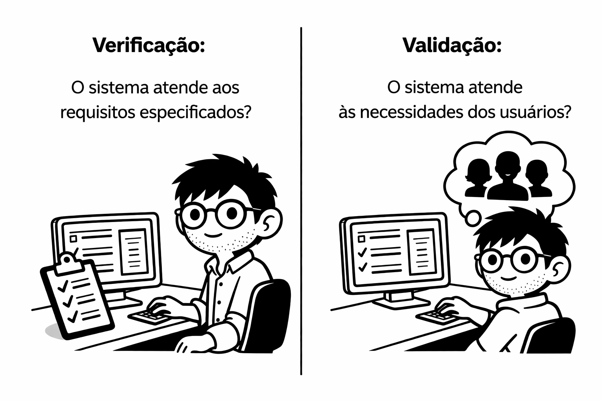
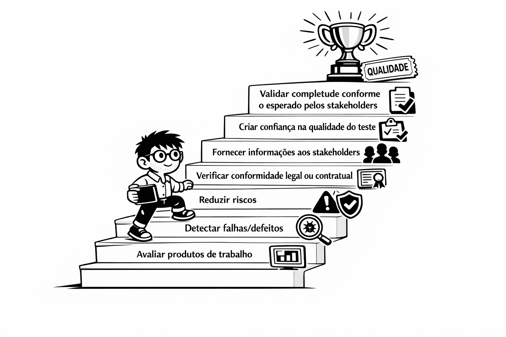
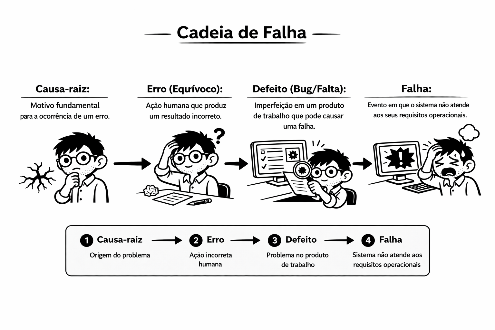

# Certified-Tester-Foundation-Level-4.0
**`Conteúdo resumido e utilizado nos meus estudos para o exame da certificação CTFL 4.0`**

---

# Fundamentos de Teste

## 1.1 O que é teste?
O teste de software é um **conjunto de atividades** para descobrir defeitos e avaliar a qualidade de artefatos (objetos de teste). Ele não se resume apenas à execução do software, mas envolve planejamento e alinhamento com o ciclo de vida de desenvolvimento (SDLC).

*   **Verificação vs. Validação:**

  

   *   **Verificação:** "Estamos construindo o produto corretamente?". Checa se o sistema atende aos requisitos especificados.
   *   **Validação:** "Estamos construindo o produto certo?". Checa se o sistema atende às necessidades dos usuários em seu ambiente operacional.
*   **Teste Estático vs. Dinâmico:** O teste **estático** não envolve a execução do código (revisões e análise estática), enquanto o **dinâmico** requer a execução do software.

### 1.1.1 Objetivos do teste

  

**Objetivos Típicos:** 
*  Avaliar produtos de trabalho
*  Detectar falhas/defeitos
*  Garantir a cobertura necessária de um objeto de teste
*  Reduzir riscos
*  Verificar conformidade legal ou contratual.
* Forneceir informações aos stackholders para tomada de decisões
*  Criar confiança na qualidade do objeto de teste
*  Validar se o objeto de teste está completo e conforme o esperado pelos stakeholders

### 1.1.2 Teste e depuração
*   **Teste vs. Depuração (Debugging):** São atividades distintas. O teste detecta falhas (dinâmico) ou defeitos (estático). A **depuração** é o processo de reproduzir, diagnosticar e corrigir a causa raiz (defeito) da falha.
---
## 1.2 Por que os testes são necessários?
O teste contribui para o sucesso do projeto ao fornecer uma avaliação direta da qualidade em vários estágios do SDLC, servindo como uma forma econômica de controle de qualidade.

*   **Teste e Garantia da Qualidade (QA):**
    *   **Controle de Qualidade (QC):** Abordagem **corretiva** e orientada ao produto. O teste é a principal forma de QC.
    *   **Garantia da Qualidade (QA):** Abordagem **preventiva** e orientada ao processo. Foca no aprimoramento dos processos para que o produto final tenha qualidade.
*   **Cadeia de Falha:**

  

  *   **Erro (Equívoco):** Ação humana que produz um resultado incorreto.
  *   **Defeito (Bug/Falta):** Imperfeição em um produto de trabalho que pode causar uma falha.
  *    **Falha:** Evento em que o sistema não atende aos seus requisitos operacionais.
  *    **Causa-raiz:** Motivo fundamental para a ocorrência de um erro.
---
## 1.3 Princípios de Teste
Existem **sete princípios** que guiam a prática de testes:
1.  **O teste mostra a presença de defeitos, não a sua ausência:** Reduz a probabilidade de falhas, mas não prova a perfeição.
2.  **Testes exaustivos são impossíveis:** Testar todas as combinações de entradas é inviável, exceto em casos triviais.
3.  **Testes antecipados economizam tempo e dinheiro (Shift-Left):** Iniciar os testes o mais cedo possível no ciclo de vida.
4.  **Os defeitos se agrupam:** Um pequeno número de módulos costuma conter a maioria dos defeitos (Princípio de Pareto ou Regra 80/20).
5.  **Os testes se degradam (Paradoxo do Pesticida):** Testes repetidos perdem a eficácia; novos testes devem ser escritos para encontrar novos defeitos.
6.  **Os testes dependem do contexto:** Testar um sistema de missão crítica é diferente de testar um e-commerce.
7.  **Falácia da ausência de erros:** Um sistema sem erros encontrados ainda pode ser inútil se não atender às necessidades do usuário.
---
## 1.4 Atividades de Teste, Testware e Papéis no Teste

O teste de software não deve ser visto como uma atividade isolada. Na prática, ele faz parte de um processo composto por um conjunto de atividades que podem ser adaptadas de acordo com o contexto do projeto. Esse processo envolve desde o planejamento até a conclusão do teste, além da geração de artefatos, manutenção de rastreabilidade e definição de responsabilidades entre os envolvidos.

## 1.4.1 Atividades e Tarefas de Teste

Um processo de teste típico é formado por grupos de atividades que podem acontecer de forma sequencial, iterativa ou até em paralelo, dependendo da realidade do projeto.

*  **Planejamento**
    *  O planejamento de teste tem como objetivo definir o que se pretende alcançar com o teste e qual abordagem será utilizada para isso. Nessa etapa, o trabalho é organizado considerando as restrições do projeto, como tempo, orçamento, escopo e recursos disponíveis.

*  **Monitoramento e controle**
    *  O monitoramento acompanha continuamente o progresso real do teste em relação ao que foi planejado. Já o controle envolve a tomada de ações quando são identificados desvios, com o objetivo de manter o teste alinhado aos seus objetivos.
*  **Análise**
    *  A análise de teste busca identificar **o que deve ser testado**. Para isso, a base de teste é examinada com o objetivo de definir e priorizar condições de teste, além de identificar riscos relacionados ao objeto de teste.

*  **Modelagem**
    *  A modelagem, também chamada de projeto de teste, responde à pergunta **como testar**. Nessa atividade, são criados os casos de teste, os itens de cobertura e também são definidos os requisitos relacionados a dados de teste e ambiente.

*  **Implementação**
    *  A implementação envolve a criação ou obtenção do material necessário para executar os testes, como scripts e dados de teste. Também é nessa etapa que os casos de teste são organizados em uma sequência ou cronograma de execução.

*  **Execução**
    *  Na execução, os testes são realizados conforme o planejado. Os resultados reais são comparados com os resultados esperados, e qualquer comportamento inesperado ou anomalia deve ser registrado para posterior análise.

*  **Conclusão**
    *  A conclusão de teste ocorre em marcos definidos do projeto, como o fim de uma iteração ou uma entrega. Essa etapa envolve o arquivamento de materiais úteis, o encerramento do ambiente de teste e a elaboração do relatório de conclusão.

---

## 1.4.2 Processo de Teste no Contexto

O processo de teste não acontece da mesma forma em todos os projetos. A maneira como ele será executado depende de fatores internos e externos que influenciam a estratégia adotada, as técnicas utilizadas e até o nível de automação aplicado.

Entre os principais fatores de contexto, destacam-se:

*  **Stakeholders**
    *  As necessidades, expectativas e o nível de cooperação dos stakeholders influenciam diretamente o processo de teste.

*  **Membros da equipe**
    *  As habilidades, o conhecimento técnico e a experiência das pessoas envolvidas afetam a forma como o teste será conduzido.

*  **Domínio do negócio**
    *  A criticidade do sistema, as exigências legais e regulatórias e as necessidades do mercado impactam as decisões relacionadas ao teste.

*  **Fatores técnicos**
    *  O tipo de software, a arquitetura do sistema e as tecnologias utilizadas também influenciam a abordagem de teste.

*  **Restrições do projeto**
    *  Limitações de escopo, prazo, orçamento e recursos precisam ser consideradas na definição do processo de teste.

*  **Fatores organizacionais**
    *  A estrutura da organização, suas políticas internas e as práticas já adotadas podem direcionar a forma como o teste será realizado.

*  **Ciclo de vida de desenvolvimento**
    *  O modelo de desenvolvimento utilizado, como sequencial, iterativo ou ágil, impacta diretamente a execução das atividades de teste.

*  **Ferramentas**
    *  A disponibilidade, a usabilidade e a adequação das ferramentas utilizadas no projeto também influenciam o processo de teste.

---

## 1.4.3 Testware

Testware é o nome dado aos produtos de trabalho gerados durante o processo de teste. Esses artefatos servem para apoiar, organizar, registrar e evidenciar as atividades executadas ao longo do processo.

Exemplos de testware por atividade:

### No planejamento
- Plano de teste
- Cronograma
- Registro de riscos

### No monitoramento
- Relatórios de progresso

### Na análise
- Condições de teste priorizadas
- Relatórios de defeitos identificados na base de teste

### Na modelagem
- Casos de teste
- Cartas de teste
- Requisitos de ambiente

### Na implementação
- Scripts de teste
- Conjuntos de teste
- Dados de teste

### Na execução
- Registros de teste
- Relatórios de defeitos

### Na conclusão
- Relatório de conclusão
- Lições aprendidas
- Solicitações de alteração

---

## 1.4.4 Rastreabilidade entre a Base de Teste e o Testware

A rastreabilidade entre a base de teste e o testware é importante para garantir mais controle, visibilidade e consistência ao longo do processo.

Manter essa rastreabilidade permite:

### Avaliar a cobertura
Verificar se requisitos, riscos e outros elementos da base de teste estão devidamente cobertos pelos casos de teste criados.

### Realizar análise de impacto
Entender como alterações em requisitos ou outros artefatos afetam os testes já existentes.

### Aumentar a transparência
Facilitar a compreensão dos relatórios por parte dos stakeholders, conectando informações técnicas aos objetivos do negócio.

---

## 1.4.5 Papéis no Teste

As responsabilidades relacionadas ao teste podem ser divididas em dois grandes papéis. Dependendo do contexto do projeto, essas funções podem ser desempenhadas por pessoas diferentes ou até pela mesma pessoa.

### Gerenciamento de teste

Esse papel está mais voltado à visão geral do processo. Envolve liderança, planejamento, monitoramento, controle e conclusão das atividades de teste.

### Testador

Esse papel está mais relacionado à parte técnica do processo. Envolve atividades como análise, modelagem, implementação e execução dos testes.

---

## 1.5 Habilidades Essenciais e Boas Práticas
*   **Habilidades Genéricas:** Meticulosidade, curiosidade, pensamento crítico, conhecimento técnico e do domínio, além de **excelente comunicação** para relatar más notícias de forma construtiva.
*   **Abordagem de Equipe Completa:** Todos os membros da equipe (incluindo desenvolvedores e representantes do negócio) compartilham a responsabilidade pela qualidade.
*   **Independência dos Testes:** Testadores de fora da equipe de desenvolvimento trazem diferentes perspectivas e evitam vieses cognitivos, sendo mais eficazes na localização de defeitos, embora possam sofrer com o isolamento.

---

# Testes ao longo do Ciclo de Vida de Desenvolvimento de Software

O teste de software não acontece de forma isolada no final do desenvolvimento. Ele está presente ao longo de todo o ciclo de vida do software, contribuindo para a qualidade desde as fases iniciais até a entrega final.

Este capítulo aborda como o teste se integra ao ciclo de vida de desenvolvimento, os diferentes níveis de teste, os tipos de teste, a manutenção de testes e a importância de práticas colaborativas como DevOps.

---

## 2.1 Teste no contexto do ciclo de vida de desenvolvimento

O teste deve ser integrado ao ciclo de vida de desenvolvimento de software (SDLC), independentemente do modelo adotado. Isso significa que as atividades de teste acompanham as fases do desenvolvimento e não devem ser deixadas apenas para o final.

O envolvimento antecipado do teste permite identificar defeitos mais cedo, reduzindo custos e aumentando a qualidade do produto.

Diferentes modelos de desenvolvimento influenciam a forma como o teste é aplicado:

### Modelo sequencial (Waterfall)

O teste ocorre após as fases de desenvolvimento. Nesse modelo, os níveis de teste são bem definidos e executados de forma mais estruturada.

### Modelos iterativos e incrementais

O desenvolvimento ocorre em ciclos menores, e o teste acompanha cada incremento. Isso permite feedback mais rápido e ajustes contínuos.

### Modelos ágeis

O teste é integrado ao desenvolvimento desde o início. As atividades de teste acontecem continuamente dentro das iterações, com forte colaboração entre os membros do time.

---

## 2.2 Níveis de teste

Os níveis de teste representam diferentes estágios em que o software é avaliado. Cada nível tem objetivos específicos e foca em partes diferentes do sistema.

### Teste de componente (ou unidade)

Foca em partes individuais do sistema, como funções ou classes. Geralmente é realizado por desenvolvedores e tem como objetivo verificar o funcionamento correto de pequenas unidades de código.

### Teste de integração

Verifica a interação entre componentes ou sistemas. O objetivo é identificar problemas na comunicação e integração entre partes do sistema.

### Teste de sistema

Avalia o sistema completo, verificando se ele atende aos requisitos especificados. Nesse nível, o sistema é testado como um todo.

### Teste de aceitação

Tem como objetivo validar se o sistema atende às necessidades dos usuários e está pronto para uso. Normalmente envolve stakeholders ou usuários finais.

---

## 2.3 Tipos de teste

Os tipos de teste estão relacionados aos objetivos específicos que se deseja validar no sistema.

### Testes funcionais

Verificam se o sistema realiza corretamente as funcionalidades esperadas, conforme os requisitos.

### Testes não funcionais

Avaliam características como desempenho, usabilidade, segurança, confiabilidade e compatibilidade.

### Testes estruturais (caixa branca)

Baseiam-se na estrutura interna do sistema, como código, lógica e fluxos de execução.

### Testes relacionados a mudanças

São realizados quando o sistema sofre alterações, com o objetivo de garantir que mudanças não introduziram novos defeitos.

---

## 2.4 Teste de manutenção

O teste de manutenção ocorre após mudanças no sistema já em produção ou em uso.

Essas mudanças podem ocorrer por:
- Correções de defeitos
- Melhorias no sistema
- Adaptações a mudanças no ambiente

Nesse contexto, dois tipos de teste são importantes:

### Teste de confirmação

Verifica se um defeito corrigido foi realmente resolvido.

### Teste de regressão

Garante que alterações não impactaram negativamente funcionalidades já existentes.

---

## 2.5 Teste em DevOps

No contexto de DevOps, o teste é integrado ao fluxo contínuo de desenvolvimento e entrega de software.

Nesse modelo, o objetivo é acelerar a entrega sem comprometer a qualidade. Para isso, o teste precisa ser:

- Automatizado sempre que possível
- Integrado ao pipeline de integração contínua (CI/CD)
- Executado com frequência
- Alinhado com práticas colaborativas entre desenvolvimento, teste e operações

O teste em DevOps reforça a ideia de que qualidade é responsabilidade de todos e que o feedback deve ser rápido e contínuo.

---

O Capítulo 2 reforça que o teste deve acompanhar todo o ciclo de vida do software, sendo adaptado ao modelo de desenvolvimento adotado. Ele apresenta os níveis de teste, os diferentes tipos de teste, a importância do teste de manutenção e o papel do teste em ambientes modernos como DevOps.

Esse entendimento é fundamental para enxergar o teste como uma atividade contínua, estratégica e integrada ao desenvolvimento, e não apenas como uma etapa final do processo.
