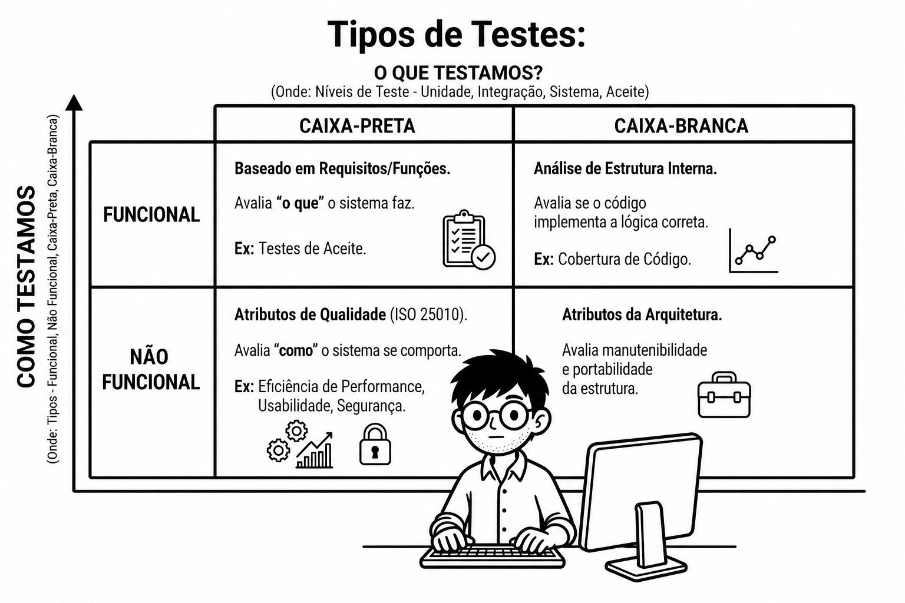

# Guia de Estudos: ISTQB - Certified Tester Foundation Level (CTFL)
**`Conteúdo resumido e utilizado nos meus estudos para o exame da certificação CTFL 4.0`**

---

# Testes ao longo do Ciclo de Vida de Desenvolvimento de Software

## 2.1 Teste no Contexto de um Ciclo de Vida de Desenvolvimento de Software (SDLC)
O teste de software deve ser adaptado ao modelo SDLC escolhido, pois isso afeta o escopo, o cronograma, as técnicas e a extensão da automação de testes. Em modelos iterativos e incrementais, como o Ágil, os testes estáticos e dinâmicos podem ser realizados em todos os níveis a cada iteração, favorecendo a automação para facilitar testes de regressão.

* **2.1.1 O impacto do Ciclo de Vida de Desenvolvimento de Software no Teste:** O modelo de desenvolvimento (Sequencial, Iterativo ou Incremental) dita o ritmo, o escopo e o momento das atividades de teste.

* **2.1.2 Ciclo de Vida de Desenvolvimento de Software e boas práticas de Teste:** Independentemente do modelo, as seguintes boas práticas devem ser aplicadas:
    * **Boas práticas de teste::** Independentemente do SDLC, para cada atividade de desenvolvimento deve haver uma atividade de teste correspondente
. Diferentes níveis de teste devem ter objetivos específicos para evitar redundância, e a análise de teste deve começar cedo.

    * **Objetivos específicos:** Cada nível de teste possui objetivos de teste específicos e apropriados para aquele nível.

    * **Análise e Modelagem precoce:** A análise e a modelagem de testes devem começar logo após a definição do produto de trabalho correspondente.

    * **Envolvimento dos testadores:** Os testadores devem estar envolvidos na revisão de documentos assim que os rascunhos estiverem disponíveis.

* **2.1.3 Teste como um Impulsionador para o Desenvolvimento de Software:** Abordagens como TDD (Desenvolvimento Orientado por Testes), ATDD (Desenvolvimento Orientado por Teste de Aceite) e BDD (Desenvolvimento Orientado pelo Comportamento) definem os casos de teste antes da escrita do código, impulsionando o desenvolvimento:

    * **TDD (Test-Driven Development):** Escrever testes unitários antes do código.
    * **ATDD (Acceptance Test-Driven Development):** Definir testes de aceite antes da codificação.
    * **BDD (Behavior-Driven Development):** Definir comportamentos em linguagem natural (Gherkin) para guiar o desenvolvimento.

* **2.1.4 DevOps e Teste:** DevOps visa criar sinergia entre desenvolvimento e operações. Ele promove feedback rápido e Integração/Entrega Contínua (CI/CD). Embora exija alta automação de testes, os testes manuais ainda são essenciais, especialmente sob a perspectiva do usuário.
* **2.1.5 A Abordagem Shift-Left:** Consiste em realizar os testes o mais cedo possível no SDLC. Inclui revisar especificações cedo, escrever casos de teste antes do código e usar análise estática, o que pode exigir mais esforço no início, mas economiza custos no final do processo.
* **2.1.6 Retrospectivas e Melhoria de Processo:** São reuniões realizadas no final de uma iteração ou marco do projeto para discutir o que foi bem-sucedido, o que pode melhorar e como incorporar essas melhorias (melhoria contínua de processos).

## 2.2 Níveis de Teste e Tipos de Teste

### 2.2.1 Níveis de Teste (Onde testamos?)
Os Níveis de Teste são grupos de atividades organizadas em conjunto para fases específicas do software
. São cinco níveis principais:

1.  **Teste de Componente (Unitário):** Foca em unidades isoladas (classes, módulos).
2.  **Teste de Integração de Componentes:** Foca nas interfaces e interações entre os componentes
3.  **Teste de Sistema:** Avalia o sistema completo e integrado em relação aos requisitos.
4.  **Teste de Integração de Sistema:** Testa as interfaces do sistema com outros sistemas e serviços externos.
5.  **Teste de Aceite:** Foca em validar se o sistema atende às necessidades de negócio dos clientes ou requisitos legais.

### 2.2.2 Tipos de Teste (O que testamos?)
Os Tipos de Teste focam em objetivos e características específicas de qualidade. Todos os quatro tipos podem ser aplicados a todos os níveis de teste:

  

* **Teste Funcional:** Avalia "o que" o sistema faz, baseando-se nos requisitos e funções que o software deve executar.

* **Teste Não Funcional:** Avalia "como" o sistema se comporta. Este tipo de teste foca nos seguintes atributos de qualidade:

    * **Eficiência de Performance:** Tempo de resposta e utilização de recursos.
    * **Compatibilidade:** Capacidade de operar em diferentes ambientes ou coexistir com outros sistemas.
    * **Usabilidade:** Facilidade de uso e satisfação do usuário.
    * **Confiabilidade:** Capacidade de manter o nível de desempenho sob condições específicas.
    * **Segurança:** Proteção de dados e resistência a ataques.
    * **Capacidade de manutenção:** Facilidade com que o sistema pode ser modificado ou corrigido.
    * **Portabilidade:** Facilidade em transferir o sistema de um ambiente para outro.

* **Teste de Caixa-Preta:** Baseia-se na especificação (Documentação) para avaliar o comportamento externo, sem olhar a estrutura interna.
* **Teste de Caixa-Branca:** Testes baseados na análise da estrutura interna, como arquitetura e estrutura interna (código) do sistema.

### 2.2.3 Testes de Confirmação e Teste de Regressão
Estes testes ocorrem em resposta a alterações feitas no software:

* **Teste de Confirmação (Re-teste):** Realizado para confirmar que um defeito específico foi corrigido com sucesso.
* **Teste de Regressão:** Realizado para garantir que mudanças recentes não causaram efeitos colaterais em áreas estáveis do sistema. Devido à repetição constante, são fortes candidatos à automação.

## 2.3 Teste de Manutenção
Focado em avaliar alterações em um software que já está em produção. Pode envolver melhorias, correções ou adaptações.

O teste de manutenção é realizado em sistemas existentes em produção devido a modificações, migrações ou desativação do software.

* **Análise de Impacto:** Realizada antes da alteração para prever possíveis consequências em outras áreas do sistema, ajudando a definir o escopo ideal para os testes de regressão.
* **Fatores (Acionadores):** O teste de manutenção pode ser acionado por modificações (hot fixes, novos recursos), atualizações e migrações de ambiente, ou pela aposentadoria de um software, que pode exigir testes de arquivamento e migração de dados.